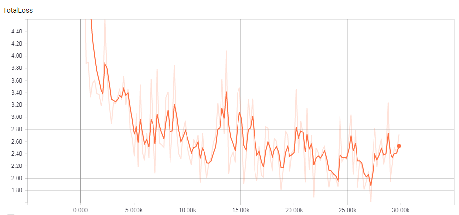
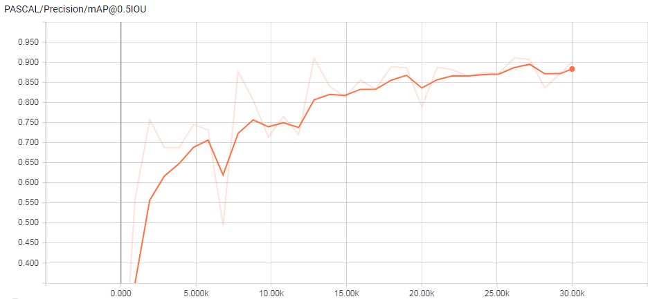
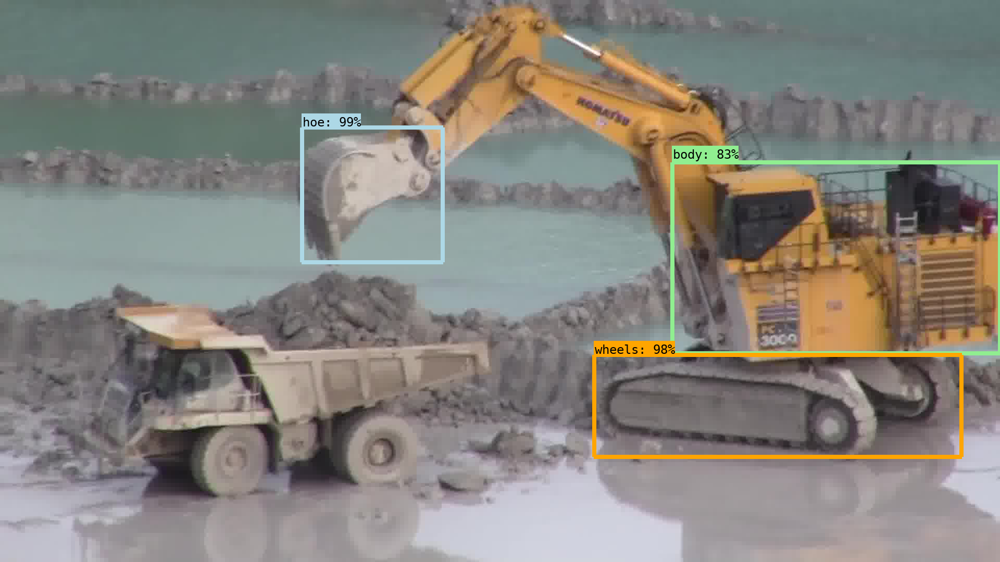
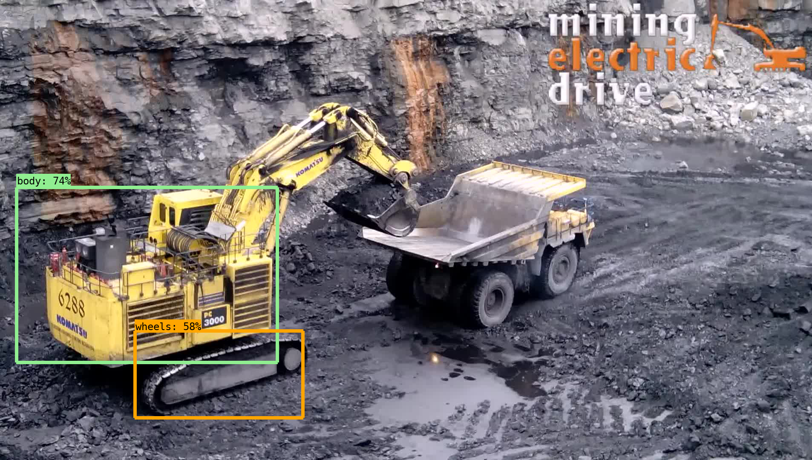
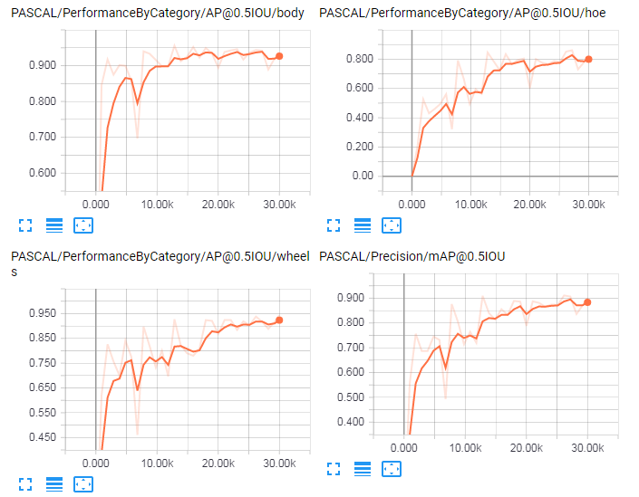

# Skycatch Machine Learning Challenge - Interview

This repository includes all the files necesary for the "Coding Challenge" part. The goal of this project is
to detect three objects from a given image: hoe, body, wheels.

The "Architecture challenge" part can be found at: https://drive.google.com/file/d/1h1Rsh3L_-RmJunu2zSWMUpHPwIKb4nhy/view?usp=sharing and 
https://www.dropbox.com/s/eurelmm01mxqrxw/Architecture_challenge.pdf?dl=0.

Questions: luis_e@outlook.com

## Getting Started
General specifications of the system which this project was trained and tested:
- Ubuntu 14.04
- Nvidia Quadro M4000
- 8 gb GPU dedicated
- 30 gb RAM
- 8x Intel(R) Xeon(R) CPU E5-2623 v4 @ 2.60GHz

In order to run the project you need the following tool installed:
- nvidia-docker https://github.com/NVIDIA/nvidia-docker/wiki/Installation-(version-1.0)

## Fisrt Steps & Usage

Description of the project folders:

    .
    ├── models            # It contains the Tensorflow object Detection
    ├── test_image        # Mapped folder with docker container, the user can put images in for inference
    ├── data              # It contains the dataset files and model configuration file
    ├── docker_share      # Mapped folder with docker container, if a training step is started the folder will contain the generated files
    └── README.md


Clone the repository:
```
git clone "https://github.com/enriquerod/skycatch-challenge"
```
Move inside the folder project:
```
cd sky-chall-gpu
```
Execute the script in order to download the TFrecord files of the dataset and the model configuration file:
```
./download.sh
```
Build the docker containner for the project, this step could take some minutes:
```
sudo nvidia-docker build -t sky-cha .
```
Run the docker image:
```
sudo nvidia-docker run -it --entrypoint /bin/bash -v $(pwd)/test_image:/tensorflow/models/research/object_detection/test_images -v $(pwd)/docker_share:/tensorflow/models/research/object_detection/training --name sky -p 8888:8888 sky-cha
```
Now we can train the model or inference a image with the already trainned model. 

NOTE: It is not necesary to train the model, there is already the necesary files to run an inference or test the model.

### Training

Move to the folder of interest:
```
cd models/research/object_detection
```
Execute the training script:
```
python3 train.py --logtostderr --train_dir=training/ --pipeline_config_path=ssd_mobilenet_v1.config
```
Now it will start to train the model, for default it is set to train up to 30,000 steps.
After the training is finished, we have to gnerate the inference graph of the model. The frozen inference graph is generated 
from a given checkpoint of the training step. 
In the folder "training" is saved these checkpoints:

    .
    ├── ...
    ├── training                                    # This folder contains all the files generated during training
    │   ├── model.ckpt-27178.data-00000-of-00001    
    │   ├── model.ckpt-27178.index                  
    │   ├── model.ckpt-27178.meta         
    │   └── ...                 
    ├── sky-chall                                   # This folder cointains the frozen inference graph
    └── ...

It is just needed to change the "name_of_checkpoint" for one of the checkpoint of your interest in the training folder.

```
python3 export_inference_graph.py \
	--input_type image_tensor \
	--pipeline_config_path ssd_mobilenet_v1.config \
	--trained_checkpoint_prefix training/name_of_checkpoint \
	--output_directory sky-chall
  ```

Example of execution:
```
python3 export_inference_graph.py \
	--input_type image_tensor \
	--pipeline_config_path ssd_mobilenet_v1.config \
	--trained_checkpoint_prefix training/model.ckpt-27178 \
	--output_directory sky-chall
  ```
It will save the frozen model ready for the testing step.

### Testing
Move to the folder of interest:
```
cd models/research/object_detection
```
To test an image first put it in the test_image folder of the host system, it will copy the images inside this folder
to the running container.

NOTE: There are already 5 images inside test_image folder.
```
python3 test_im.py --im_path test_images/image_name.jpg
```
Example to execute the testing script:
```
python3 test_im.py --im_path test_images/komatsu022_movie79.jpg
```

The script will generate 2 files for each test, one is the image overlaid with the bounding boxes of the objects detected and a .csv 
file with the information of each object detected from the given image.


## Project Process


### Model
This project is emplemented mainly with the [Tensorflow Object Detection](https://github.com/tensorflow/models/tree/master/research/object_detection). 
After a review on the convolutional neural networks [pre-trained](https://github.com/tensorflow/models/blob/master/research/object_detection/g3doc/detection_model_zoo.md)
in the tensorflow object detection, the [single shot multibox detector model](https://arxiv.org/pdf/1512.02325.pdf) shows a faster inference and training on the [COCO dataset](http://cocodataset.org/), tence the ssd_mobilenet_v1_coco was selected
to be trained for this project.

### Dataset
The dataset was divided in ~70% for training, ~15% for validation and ~15% testing. Given the 62 movie folders in the dataset, it was filtered 
to only obtain the images with the xml file (ground truth) resulting in a total of 3191 images. After that the remaining dataset was shuflled arbitrary in order to split it
for the training, validation adn testing part.

### Training
The training was setted up emperically to run upto 30,000 steps, it used the hyperparameters of a ssd_mobilenet_v1_coco pre-trained on [COCO dataset](http://cocodataset.org/)
thus this project had not to be trained from zero. 
During the training the model got a minimun loss with and a high mAP precision at the step 27,178.
The next two graphics show the both loss and precision tend to converge. 




The next table shows the results of the training at the last steps:

|Step|Loss|mAP|
|:---:|:---:|:---:|
|30,000|2.715|0.9004|
|27,178|1.611|0.9067|
|26,160|2.285|0.9109|

Examples of the object detection, the model used was trained with the frozen inference graph of the setp 27178:





The whole training takes almost 5 hours to finish running on gpu with the specifications of the system given in the "Getting Started" section.

### Evaluation
The performance was measured with the [Pascal 0.5 IoU metric](http://homepages.inf.ed.ac.uk/ckiw/postscript/ijcv_voc09.pdf) that is defined as an intersection-over-union greater than 0.5.
This [metric](https://github.com/tensorflow/models/blob/master/research/object_detection/g3doc/evaluation_protocols.md) is already implemented on tensorflow.
The performance for each class in the training process is given below:



